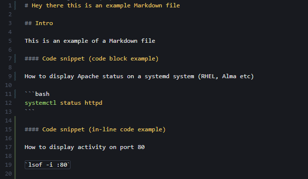
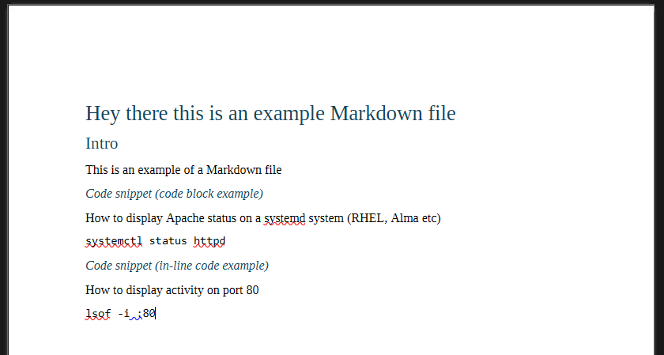

# obsidian-docx-converter 

The project is a built to convert Obsidian - flavoured Markdown notes into editable .docx Word Documents, while preserving the Obsidian specific styling.

Designed for technical documentation workflows where Word documents are still required for editing, review, or management sign-off.

---

### Current Features

- Basic Markdown -> docx conversion 
- Pandoc Integration 
- Python conversion pipeline

---

### Planned Features

-  Obsidian image embed support
-  Callout conversion
-  wiki-link handling
-  DOCX templating
-  Improved and preserved Code block and in-line code styling
-  Recursive Vault exporting

---

### Example of Phase 1 conversion

| Markdown | DOCX |
|---|---|
|  |  |

---

### Future Packaging Goals

Planned future distribution options:

- Python package
- Windows executable (`.exe`)
- CLI utility